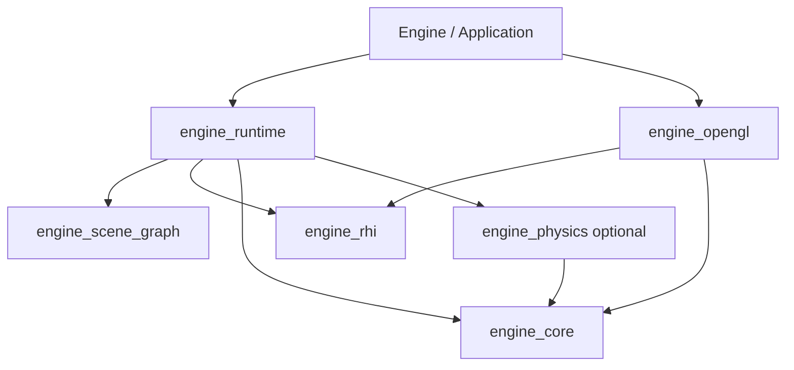

# Engine 架构整改详细设计与执行计划

> 执行者说明：按任务编号逐项执行；可使用 `executing-plans` 技能跟踪步骤。所有任务使用复选框记录实际进度，完成验收后才能勾选。本文是设计与实施计划，不表示代码已经完成修改。

**Goal:** 修复已确认的正确性问题，统一场景数据与资源生命周期，建立可独立验证的模块和可迁移的构建产物。

**Architecture:** 保留现有 OpenGL 渲染路径，先建立测试和修复边界，再将场景树提取为帧内不可变数据，统一通过命令执行器调用 RHI。构建采用小型基础库与运行时库组合，不在本轮强行把仍相互依赖的资产、场景加载和渲染拆成循环链接的静态库。

**Tech Stack:** C++23、CMake 3.25+、Visual Studio 2022/MSVC、OpenGL 4.5、GLFW、GLEW、GLM、vcpkg manifest；新增 Catch2 3 作为测试依赖。

**日期:** 2026-09-10。**基线:** `b2f399a` 加当前工作区已有修改。文中路径均相对于 Engine 根目录。

---

## 阅读导航

- [问题追踪表](#2-问题到任务的追踪)
- [模块和依赖边界](#3-目标模块与依赖边界)
- [执行阶段与依赖](#5-执行顺序与交付门槛)
- [测试与最小构建边界](#t01-建立独立测试入口和最小构建边界)
- [场景树所有权](#t06-场景树唯一所有权与加载事务)
- [帧数据契约](#t07-定义真正的-renderscene-帧数据)
- [命令与提交所有权](#t08-紧凑命令所有权提交与统一执行器)
- [最终构建配置](#t12-最终构建组织工具链与头文件边界)
- [安装和资源路径](#t13-资源路径与安装包)
- [最终回归矩阵](#t14-最终回归性能记录和文档闭环)

## 1. 执行范围和事实基线

### 1.1 已验证的事实

- `cmake --build --preset debug --parallel 4` 增量构建成功。
- `Bin/Debug-x64/Engine/Engine.exe --test-rhi` 输出测试通过。
- `ctest --test-dir Build -N` 返回 `Total Tests: 0`。
- 当前 `CMakePresets.json` 已有用户修改；不能用旧版本覆盖它。
- 当前 clangd 缓存选择 MinGW GCC，而预设依赖 triplet 为 `x64-windows`。
- 当前默认渲染路径是 `FORWARD_RENDER=0`，命令执行模式实际默认为 `Immediate`。
- 本次没有完成全新环境构建、Release 构建、真实 OpenGL 图像验证；后文相关条目属于实施验收要求。

### 1.2 与已有文档的关系

`CommandQueue_Design.md`、`OpenGL_RHI_Migration_Plan.md`、`Source/scene/REFACTOR_PLAN.md` 作为历史背景保留。它们描述的部分目标尚未在代码中形成完整闭环：

1. `RenderPass` 仍按值保存包含指针的旧 `RenderScene`。
2. 模型仍从 `RenderableModel` 队列绘制，`MeshComponent` 未成为统一渲染数据源。
3. Pass 和模型绘制仍共享全局 UBO CPU 暂存状态。
4. `sortAndFlush()` 排序的是状态命令流，不是完整绘制批次。

本计划的完成判据以代码、测试和任务验收为准。完成 T14 时更新旧文档状态并链接本文，不删除历史设计。

### 1.3 设计决策

| 方案 | 代价 | 决策 |
|---|---|---|
| 只修局部 bug，维持现有双场景模型和全局状态 | 短期最快，但后续每次迁移都要维护双写 | 仅作为 T02/T03 的临时阶段 |
| 渐进修复、统一数据与所有权、逐步拆 target | 每阶段能构建，能保留既有渲染效果 | 本轮采用 |
| 同时引入 ECS、FrameGraph、多渲染后端、跨帧并行 | 改动面过大，难以定位效果回归 | 不纳入本轮 |

本轮不改变现有场景 JSON 字段含义和 GLSL 的 UBO binding 布局；保留前向和延迟光照两种路径。允许修复明确错误造成的画面差异，例如光球恢复显示、透明物体恢复绘制。

## 2. 问题到任务的追踪

| 编号 | 问题与原始定位 | 负责任务 | 验收重点 |
|---|---|---|---|
| F01 | `thread/ThreadPool.cpp` 锁外读取队列 | T02 | 无锁外队列访问，异常可观察，无永久等待 |
| F02 | `TextureLoader.cpp` lambda 成功路径无返回值 | T02、T05 | 明确 void，成功/失败任务都结束 |
| F03 | `SceneLoader.cpp` 新组件与旧模型双写、光球不绘制 | T03、T06、T07 | 一套变换，一套模型所有权 |
| F04 | `RenderPass.cpp` 保存过期 RenderScene 副本 | T03、T07 | 换天空盒、切场景后使用新帧数据 |
| F05 | `PBF.cpp` 迭代内不更新预测位置 | T11 | 每轮状态前进，与标量参考算法一致 |
| F06 | `OpenGLDevice::draw` 固定 UInt32 索引 | T04 | UInt16/UInt32、非零偏移、零 instance |
| F07 | 纹理上传依赖默认 unpack alignment | T04 | 奇数宽 R/RG/RGB 数据逐像素正确 |
| F08 | RenderScene 与 UBO/ModelRenderer 可变状态共享 | T07、T09、T10 | 工作线程录制不访问实时场景或共享暂存 |
| F09 | 每条命令内含 1040 字节 staging | T08 | 小型命令、变长 payload、无静默丢弃 |
| F10 | 单可执行目标包含所有模块和测试 | T01、T12 | CPU 测试不查找/链接图形依赖 |
| F11 | GLOB 新增源文件不触发更新 | T01、T12 | 显式 source manifest，无重复归属 |
| F12 | clangd 工具链与 MSVC 正式构建不一致 | T12 | MSVC/clang-cl + x64-windows + 明确配置 |
| F13 | assert 测试在 Release 失效、无 CTest | T01、T14 | Debug/Release 都有有效断言与非零测试数 |
| F14 | 启动依赖编译时源码绝对路径 | T13 | 安装产物在任意工作目录运行 |

实施中顺带封闭的相邻问题：节点重复所有权与环、场景加载失败后半成品提交、纹理缓存忽略设置、资源关闭顺序、窗口 resize 未重建附件、透明队列跨 Pass 残留、物理循环缺少停止协议。每项均在对应任务中定义验收，不作为无边界的清理工作。

## 3. 目标模块与依赖边界

### 3.1 最终 CMake target

| Target | 文件职责 | 允许依赖 | 不允许依赖 |
|---|---|---|---|
| `engine_core` | 线程池、时间、文件路径、CPU profiling | Threads、spdlog | RHI、GLFW、ImGui、场景、物理 |
| `engine_scene_graph` | SceneNode、Component 基类、LightComponent 数据 | glm、标准库 | Model、窗口、RHI、渲染器 |
| `engine_rhi` | RHI 类型、命令存储、执行器、队列 | glm、标准库、Threads | OpenGL、GLFW、场景、线程池 |
| `engine_opengl` | OpenGLDevice、OpenGLShaderCompiler/Program | engine_rhi、engine_core、GLEW、OpenGL、spdlog | Scene3D、RenderPass、ImGui |
| `engine_physics` | FluidSim CPU 数据、PBF、SPHKernel、UniformGrid | engine_core、glm、CompactNSearch、OpenMP | RHI、Shader、Window、UI |
| `engine_runtime` | 资产加载、Scene3D、提取器、渲染器、Pass、相机、地形、窗口/UI 适配 | 基础 target、assimp、GLFW、GLEW、ImGui、JSON、图像库；物理可选 | 不直接链接 engine_opengl |
| `Engine` | main、Application 装配、后端工厂 | engine_runtime、engine_opengl | 不包含测试实现 |
| 测试目标 | 各自 test 文件和测试支持 | 只链接被测模块、Catch2 | 不借用 main 或生产资源路径 |

`engine_runtime` 在本轮仍是较大的库，这是有意的边界选择。`Material`、`Model`、资产加载、地形与 Pass 之间目前存在真实相互引用；先改变接口，再讨论把它们拆成 `assets`、`scene_runtime`、`renderer`，不能依靠静态库循环链接掩盖依赖。

`Window`、UI 和输入适配暂在 runtime；纯 CPU 测试不链接 runtime。运行时集成测试可以链接 runtime，但用 Null/Recording 设备、不创建窗口；真实 OpenGL 测试单独链接 engine_opengl 和 GLFW。



### 3.2 文件组织

保留现有 Source 大部分目录，新增以下文件；每个文件在任务中有唯一负责者。

```text
CMakeLists.txt
CMakePresets.json
cmake/
  EngineOptions.cmake
  EngineDependencies.cmake
  EngineTargets.cmake
  EngineSources.cmake
  EngineInstall.cmake
  CheckSourceOwnership.cmake
  CheckLayering.cmake
Source/
  app/Application.h, Application.cpp
  utils/ResourcePaths.h, ResourcePaths.cpp
  scene/SceneExtractor.h, SceneExtractor.cpp
  scene/components/MeshComponent.cpp
  scene/components/SkyboxComponent.cpp
  scene/components/TerrainComponent.cpp
  graphics/renderer/DrawItem.h
  graphics/renderer/RenderResources.h, RenderResources.cpp
  graphics/renderer/renderpass/forward/ForwardTransparentPass.h, .cpp
  graphics/renderer/FluidRenderer.h, FluidRenderer.cpp
  rhi/include/RHICommandExecutor.h
  rhi/RHICommandExecutor.cpp
  rhi/RHICommandQueue.cpp
  graphics/renderer/ParallelRecorder.h, ParallelRecorder.cpp
  physics/fluid/ParticleState.h
  physics/fluid/FluidSimulationRunner.h, .cpp
Tests/
  CMakeLists.txt
  support/RecordingDevice.h, RecordingDevice.cpp
  support/GLTestContext.h, GLTestContext.cpp
  core/ThreadPoolTests.cpp
  core/ResourcePathsTests.cpp
  rhi/NullDeviceTests.cpp
  rhi/CommandBufferTests.cpp
  rhi/CommandQueueTests.cpp
  rhi/OpenGLDeviceTests.cpp
  scene/SceneNodeTests.cpp
  runtime/SceneExtractionTests.cpp
  runtime/ResourceLifetimeTests.cpp
  runtime/TextureLoaderTests.cpp
  runtime/RenderPipelineTests.cpp
  runtime/ParallelRecordingTests.cpp
  physics/PBFTests.cpp
  physics/FluidRunnerTests.cpp
  fixtures/scenes/minimal.json
  fixtures/scenes/missing-model.json
```

模块 CMake 文件分工：Options 只定义选项；Dependencies 只查依赖；Sources 是显式源清单；Targets 定义编译目标；Install 定义部署。禁止每个文件各自设置全局编译选项。

## 4. 核心不变量

1. 每个场景节点和组件恰有一个 owner；业务指针仅是借用，不能删除。
2. 一个模型的 CPU/GPU 包装对象只有一个 owner；纹理与 Shader cache 明确拥有缓存资源。
3. 场景增删、资产替换、设备创建销毁都在主线程的帧边界进行。
4. 首轮只允许一个 CPU frame 在录制/回放中；上一帧 CPU 回放结束后才能卸载该帧借用的资源。
5. `CommandQueue::flush()` 只表示 CPU 命令已提交给设备，不等于 GPU 完成；OpenGL 删除遵循同一 context 的 API 语义。新增显式后端时必须另行实现 GPU fence 和退休队列。
6. `RenderScene` 是值数据加资源 handle，不包含 SceneNode、Scene3D、ModelRenderer、camera 或可变 UBO 管理器指针。
7. Pass 不保存 RenderScene；其 `execute`/`record` 接收当前帧的 `const RenderScene&`。
8. 录制只构造命令和命令数据；所有 GL 调用和资源上传在具有 GL context 的线程执行。
9. 命令队列持有已提交 buffer 的所有权；生产者提交后可以析构或重新使用自己的空 buffer。
10. 不对状态命令流做全局排序；只能对 Pass 内完整 DrawItem 排序，再按顺序生成绑定与 draw。
11. 同一份命令分发代码服务即时模式与延迟模式。
12. CPU 单元测试不得依赖本机 OpenGL、源码 Assets 或工作目录。

## 5. 执行顺序与交付门槛

| 阶段 | 任务 | 产出门槛 |
|---|---|---|
| M0 建立验证 | T00、T01 | 测试可独立运行；已有工作区变更得到保留 |
| M1 修复确定错误 | T02、T03、T04 | 线程池、资源加载回调、场景快照、RHI 回归测试通过 |
| M2 收敛所有权 | T05、T06 | 有序关闭；节点树为唯一模型来源 |
| M3 数据与命令边界 | T07、T08、T09 | 不可变帧数据、紧凑命令、完整单线程回放 |
| M4 并发与物理 | T10、T11 | 并行录制与串行等价；物理可独立测试 |
| M5 构建与部署 | T12、T13、T14 | 干净构建矩阵、安装测试、文档状态闭环 |

依赖链：`T00 -> T01 -> T02 -> T03 -> T04 -> T05 -> T06 -> T07 -> T08 -> T09 -> T10 -> T11 -> T12 -> T13 -> T14`。

采用串行任务顺序，避免同时修改 Scene3D、CommandBuffer 或 CMake。每个任务可拆成多个小提交；提交前仅暂存该任务的明确路径，不使用 `git add .`。本轮只交付计划，不执行这些提交。

---

## T00. 固定基线与创建执行记录

**修改文件:** 本文的任务复选框；实施时新增 `docs/validation/engine-refactor.md`。

- [ ] 在 Engine 根目录记录以下输出，不移动或清理现有 Build 目录。

```powershell
git status --short
git rev-parse HEAD
cmake --version
cmake --list-presets
cmake --build --preset debug --parallel 4
.\Bin\Debug-x64\Engine\Engine.exe --test-rhi
ctest --test-dir Build -N
```

- [ ] 执行记录写入：提交 SHA、日期、编译器版本、GPU/驱动、命令与退出码、已有修改路径。
- [ ] 用当前 `Assets/scene/sponza.json` 和 `Assets/scene/only_skybox.json` 记录初始画面；在具备图形环境时完成，不把未运行项目标成通过。
- [ ] 建立两种渲染路径与 Immediate/Deferred 四个组合的结果表；初始不能切换的组合记录“尚无运行入口”，T09 补齐后验证。

**完成标准:** 已有源码和配置修改未被回退；后续构建使用新的 `out/build/` 目录，不复用可能污染的 clangd cache。

## T01. 建立独立测试入口和最小构建边界

**新增:** `cmake/EngineOptions.cmake`、`EngineDependencies.cmake`、`EngineSources.cmake`、`EngineTargets.cmake`、`Tests/CMakeLists.txt`、`Tests/rhi/NullDeviceTests.cpp`。

**修改:** `CMakeLists.txt`、`vcpkg.json`、`Source/main.cpp`、`Source/pch.h`、RHI 公共头；从生产源码清单移除 `Source/rhi/null/NullDeviceTest.cpp`，迁移完成后删除该旧测试文件。

### T01.1 测试框架与选项

- [ ] 将生产 `testNullDevice()` 逐条转为 Catch2 `REQUIRE/CHECK`，调用初始化不得置于会被编译配置移除的断言内。
- [ ] main 删除 `--test-rhi` 分支和测试前向声明；README 明确由 CTest 替代。
- [ ] 定义以下选项。T01 中 `ENGINE_WITH_PHYSICS` 控制 runtime 中既有物理源，T11 后再变为独立 engine_physics；没有拆完之前不得宣称物理 headless 构建可用。

```cmake
option(ENGINE_BUILD_APP "Build the graphical application" ON)
option(ENGINE_WITH_OPENGL "Build the OpenGL backend" ON)
option(ENGINE_WITH_PHYSICS "Build fluid simulation" ON)
option(ENGINE_BUILD_GL_TESTS "Build tests requiring an OpenGL context" OFF)
option(ENGINE_ENABLE_PCH "Enable private target precompiled headers" ON)
include(CTest)
if(ENGINE_BUILD_APP AND NOT ENGINE_WITH_OPENGL)
    message(FATAL_ERROR "Engine application requires ENGINE_WITH_OPENGL=ON")
endif()
if(ENGINE_BUILD_GL_TESTS AND NOT ENGINE_WITH_OPENGL)
    message(FATAL_ERROR "OpenGL tests require ENGINE_WITH_OPENGL=ON")
endif()
```

- [ ] vcpkg 保持现有 registry baseline 和 CompactNSearch overlay 不变；基础依赖保留 glm、spdlog、nlohmann-json，图形依赖移入 `renderer` feature，CompactNSearch 移入 `physics`，Catch2 移入 `tests`。合并两条重复 imgui 依赖。

```json
{
  "name": "engine",
  "version": "1.0.0",
  "dependencies": ["glm", "spdlog", "nlohmann-json"],
  "default-features": ["renderer", "physics"],
  "features": {
    "renderer": {
      "description": "Graphics application dependencies",
      "dependencies": [
        "assimp", "glew", "glfw3", "soil",
        { "name": "imgui", "features": ["glfw-binding", "opengl3-binding"] }
      ]
    },
    "physics": {
      "description": "Fluid solver dependencies",
      "dependencies": ["compactnsearch"]
    },
    "tests": {
      "description": "Unit and integration test framework",
      "dependencies": ["catch2"]
    }
  }
}
```

保留 soil 是为了不把 stb 符号来源变化混入目标拆分。当前 terrain 仍使用 `SOIL_LOAD_L`，且 Source 中未找到自有 `STB_IMAGE_IMPLEMENTATION`；不能只删除链接依赖。替换图像库不属于本轮必做项。

### T01.2 初始 target 与头文件

- [ ] `engine_rhi` 首先独立：源文件为 `Source/rhi/RHICommandBuffer.cpp`、`Source/rhi/src/RHIContext.cpp`；T08 加入 Executor/Queue 实现，T09 删除 Context。
- [ ] `engine_opengl` 源文件为 `Source/rhi/opengl/OpenGLDevice.cpp`、`OpenGLShaderCompiler.cpp`、`OpenGLShaderProgram.cpp`。
- [ ] `Source/rhi/RHIFactory.cpp` 暂由应用 target 编译，防止公共 RHI 因工厂反向链接所有后端。
- [ ] `engine_runtime` 暂收纳除 main、RHI、旧测试外的生产源；T02、T06、T11 再分别抽出 core、scene_graph、physics。每个阶段调整清单后立刻构建。
- [ ] 用显式 `ENGINE_RHI_SOURCES`、`ENGINE_RUNTIME_SOURCES` 清单替代生产 GLOB；从 `rg --files Source -g '*.cpp'` 的当前结果逐一分配，不从旧 vcxproj 复制过时清单。
- [ ] 公共 RHI 头直接包含所需的 `<cstdint>`、`<vector>`、`<string>`、`<memory>`，不依赖强制 PCH 注入。
- [ ] `pch.h` 保留为 runtime 私有优化；RHI、测试不使用它。只有实际需要 `DebugEvent.h` 的翻译单元才显式包含它。

Target 创建条件在 T01 就确定：engine_rhi 始终构建；engine_opengl 由 ENGINE_WITH_OPENGL 控制；engine_runtime 由 `ENGINE_BUILD_APP OR ENGINE_BUILD_GL_TESTS` 控制；Engine 仅由 ENGINE_BUILD_APP 控制。后续独立的 engine_physics 由 ENGINE_WITH_PHYSICS 控制。runtime 中对 FluidSim 的代码用 CMake 传播的 `ENGINE_WITH_PHYSICS=0/1` 在类型定义和调用处成对处理，关闭时不创建、不调用物理对象。

renderer 依赖仅在 runtime/OpenGL 被请求时查找。core 配置不得因为 BUILD_TESTING=ON 就创建 engine_runtime。T03 的 runtime 测试在 `TARGET engine_runtime` 时注册；T04 的 gl 测试额外要求 ENGINE_BUILD_GL_TESTS。

```cmake
add_library(engine_rhi STATIC ${ENGINE_RHI_SOURCES})
target_include_directories(engine_rhi PUBLIC "${PROJECT_SOURCE_DIR}/Source")
target_compile_features(engine_rhi PUBLIC cxx_std_23)
target_link_libraries(engine_rhi PUBLIC glm::glm)

if(BUILD_TESTING)
    find_package(Catch2 3 CONFIG REQUIRED)
    add_subdirectory(Tests)
endif()
```

```cmake
# Tests/CMakeLists.txt 的初始内容
include(Catch)
add_executable(engine_rhi_tests rhi/NullDeviceTests.cpp)
target_link_libraries(engine_rhi_tests PRIVATE engine_rhi Catch2::Catch2WithMain)
catch_discover_tests(engine_rhi_tests
    TEST_PREFIX "rhi." PROPERTIES LABELS "unit;rhi"
    DISCOVERY_MODE PRE_TEST)
```

```cpp
#include <catch2/catch_test_macros.hpp>
#include "rhi/null/NullDevice.h"

TEST_CASE("Null device initializes and allocates distinct handles") {
    engine::rhi::NullDevice device;
    REQUIRE(device.initialize());
    const auto texture = device.createTexture({});
    const auto buffer = device.createBuffer({});
    REQUIRE(static_cast<bool>(texture));
    REQUIRE(static_cast<bool>(buffer));
    REQUIRE(texture.getId() != buffer.getId());
    device.destroyTexture(texture);
    device.destroyBuffer(buffer);
    device.terminate();
}
```

### T01.3 执行验证

以下命令使用独立目录，原有 Build 不受影响。安装依赖需要网络或已缓存 vcpkg 包；缺少依赖属于环境阻塞，不是测试通过。

```powershell
cmake -S . -B out/build/core -G "Visual Studio 17 2022" -A x64 -DCMAKE_TOOLCHAIN_FILE="$env:VCPKG_ROOT/scripts/buildsystems/vcpkg.cmake" -DVCPKG_TARGET_TRIPLET=x64-windows -DVCPKG_MANIFEST_NO_DEFAULT_FEATURES=ON -DVCPKG_MANIFEST_FEATURES=tests -DENGINE_BUILD_APP=OFF -DENGINE_WITH_OPENGL=OFF -DENGINE_WITH_PHYSICS=OFF -DBUILD_TESTING=ON
cmake --build out/build/core --config Debug --parallel 4
ctest --test-dir out/build/core -C Debug --output-on-failure --no-tests=error
cmake --build out/build/core --config Release --parallel 4
ctest --test-dir out/build/core -C Release --output-on-failure --no-tests=error
```

**完成标准:** 两种配置测试均非零且通过；core 配置不调用 `find_package(GLEW/glfw3/imgui/assimp/CompactNSearch)`。缺少 renderer feature 但请求 app 时，要给出明确配置错误，不能偷偷下载安装另一套依赖。

## T02. 线程池和纹理回调修复

**修改:** `Source/thread/ThreadPool.h/.cpp`、`SpinLock.h` 的依赖；`Source/utils/loaders/TextureLoader.cpp`；`cmake/EngineSources.cmake`、`EngineTargets.cmake`、`Tests/CMakeLists.txt`。

**新增:** `Tests/core/ThreadPoolTests.cpp`。

### T02.1 API 与状态机

- [ ] ThreadPool 使用 `std::mutex`、`std::condition_variable`、`std::queue<std::function<void()>>`；删除 SpinLock 在该类中的使用。所有队列访问和任务计数访问都在同一 mutex 下。
- [ ] 公开 `submit(std::function<void()>) -> std::future<void>`、`waitIdle()`、`shutdown()`；构造参数仍是 worker 数，0 表示自动且至少 1。
- [ ] `m_Pending` 表示排队加执行中的任务；只有任务执行完成后才递减。`shutdown` 在锁内关闭接受任务、唤醒 worker、排空已接收任务，再 join。
- [ ] `submit` 在关闭后抛出 `std::runtime_error`；空函数抛 `std::invalid_argument`。worker 不允许调用本池 `waitIdle/shutdown`，通过线程局部当前池标记检测并抛 `std::logic_error`；池对象必须由非 worker 线程拥有和销毁。
- [ ] 使用 packaged_task 保存任务异常；future.get 抛出原异常，worker 继续处理其他任务。

核心队列逻辑按下列方式实现，成员字段按此命名；构造时创建 worker，析构调用 shutdown，显式禁止复制和移动。

```cpp
std::future<void> ThreadPool::submit(std::function<void()> fn) {
    if (!fn) throw std::invalid_argument("empty task");
    auto task = std::make_shared<std::packaged_task<void()>>(std::move(fn));
    auto future = task->get_future();
    {
        std::lock_guard lock(m_Mutex);
        if (!m_Accepting) throw std::runtime_error("thread pool is closed");
        m_Tasks.emplace([task] { (*task)(); });
        ++m_Pending;
    }
    m_WorkAvailable.notify_one();
    return future;
}

void ThreadPool::workerLoop() {
    s_CurrentPool = this;
    for (;;) {
        std::function<void()> task;
        {
            std::unique_lock lock(m_Mutex);
            m_WorkAvailable.wait(lock, [this] {
                return !m_Accepting || !m_Tasks.empty();
            });
            if (m_Tasks.empty()) break;
            task = std::move(m_Tasks.front());
            m_Tasks.pop();
        }
        task(); // packaged_task captures exceptions from the user function.
        {
            std::lock_guard lock(m_Mutex);
            --m_Pending;
            if (m_Pending == 0) m_Idle.notify_all();
        }
    }
    s_CurrentPool = nullptr;
}

void ThreadPool::waitIdle() {
    if (s_CurrentPool == this) throw std::logic_error("worker cannot wait for its pool");
    std::unique_lock lock(m_Mutex);
    m_Idle.wait(lock, [this] { return m_Pending == 0; });
}
```

`shutdown()` 的调用方限制为单一 owner；重复调用在 joined 后直接返回。构造中途创建线程失败时，关闭 accepting、通知并 join 已创建线程，再重新抛出，避免析构 joinable thread 导致 terminate。

### T02.2 调用点迁移

- [ ] 暂保留 `addTask(Task*)` 适配器：接管为 shared_ptr，封装到 submit，将 future 保存到兼容 future 列表；`wait()` 先交换该列表，等待所有 future，收集第一个异常并在全部结束后重新抛出。T05 删除适配器和全局池。
- [ ] `parallelFor` 采用固定 tile 尺寸，边缘 tile 使用局部 `min(tile, remaining)`，不能修改外层循环步长；零宽高直接返回。
- [ ] TextureLoader 的外层回调显式写 `() -> void`，失败 `return;`，把状态设置为 Failed；成功排入主线程上传任务。
- [ ] 在 TextureLoader.h 定义 `enum class TextureLoadState { Pending, Ready, Failed };`，为加载记录保存状态和错误字符串。worker 仅将成功/失败结果放入受锁保护的完成队列，主线程 drain 时改变记录状态；不能 worker 写状态、主线程无锁读。T05 的实例化 loader 直接继承该状态协议。
- [ ] 引入 `engine_core` target；ThreadPool 公共头显式包含标准库头，不再包含 `pch.h`。保留全局对象只是 T05 前的过渡，不作为最终生命周期方案。

### T02.3 测试与验收

```cpp
TEST_CASE("worker survives a throwing task") {
    ThreadPool pool(2);
    auto bad = pool.submit([] { throw std::runtime_error("expected"); });
    std::atomic<int> completed{0};
    auto good = pool.submit([&] { ++completed; });
    REQUIRE_THROWS_AS(bad.get(), std::runtime_error);
    good.get();
    pool.waitIdle();
    REQUIRE(completed.load() == 1);
}
```

- [ ] 增加 4 producer 各提交 2500 个任务，每个任务递增独立计数；全部 get 后总数恰为 10000。
- [ ] 单 worker 测试、默认 worker 测试、shutdown 后提交失败、析构排空任务、worker 内 waitIdle 被拒绝。
- [ ] parallelFor 覆盖 `0x0`、`1x1`、`17x19`，每个元素恰访问一次。
- [ ] Catch2 测试统一 CTest 前缀 `core.`；执行 `ctest --test-dir out/build/core -C Debug -R '^core\.' --output-on-failure --no-tests=error`，Release 重复一次。

压力测试通过不构成“无数据竞争证明”；代码审查必须确认不存在任何锁外 `m_Tasks/m_Pending` 访问。MSVC ASan 不是 TSan，报告中不能混称。

## T03. 先修场景可见错误和过期指针

**修改:** `Source/scene/SceneLoader.cpp`、`Scene3D.cpp`、`components/MeshComponent.h`、`graphics/renderer/MasterRenderer.h/.cpp`、`renderpass/RenderPass.h`、所有具体 Pass。

**新增:** `Tests/runtime/SceneExtractionTests.cpp`、`Tests/runtime/RenderPipelineTests.cpp`、`Tests/support/RecordingDevice.h/.cpp`；加入条件构建的 `engine_runtime_tests`。

在本任务即创建 RecordingDevice，接口和事件格式按 T08.3 定义；实现 RHIDevice 的全部 override，先记录资源 create/destroy、draw、UBO 更新和绑定。T08 扩展其命令回放验收，不把该测试替身的创建推迟到使用之后。

- [ ] 短期只保留旧 RenderableModel 为光球模型 owner：点光源节点的 MeshComponent 先不持有模型，RenderableModel 持有 lightSphereModel。用栈上 `Sphere lightSphere(10,10)` 移入 Model，消除额外 Sphere 分配。T06 在同一任务内统一反转到组件所有权。
- [ ] RenderPass 临时增加 `setRenderScene(const RenderScene&)`；MasterRenderer 每次 render 后提取，向所有七个成员 Pass 更新副本。init 的探针生成也使用当前副本。
- [ ] 为避免 MasterRenderer 长期保存可能销毁的 Scene3D，临时改为 `render(Scene3D&)`、`init(Scene3D&)`；调用方每帧向 SceneManager 查询 active scene，空场景只清屏和渲染 UI。T07 替换为值快照接口。
- [ ] 所有 Skybox/Terrain 可选指针访问先判断空；无天空盒时 ProbeManager 绑定默认黑色 cubemap，关闭 IBL，不调用空对象 Draw。
- [ ] SceneLoader 对模型加载结果先检查 meshes 非空，再访问 `[0]`；失败以异常或错误结果返回，不能打印错误后宣称场景已加载成功。

此临时 setter 只用于抢先关闭悬空指针风险。T07 必须删除 setter 和持久快照副本，不能将 setter 当作最终架构。

**测试输入与断言:**

- [ ] 含一个激活点光源的最小场景：renderable 的模型非空，绘制记录至少包含对应光球 Draw。
- [ ] 连续设置天空盒 A、B：下一帧所有 Pass 指向 B，不再读 A；在 ASan 可用配置运行。
- [ ] SceneManager 加载/切换/销毁 active scene：渲染入口不保留旧 Scene3D 指针，空 active scene 不崩溃。
- [ ] 空模型路径和无天空盒场景：明确失败/降级，不发生数组越界或空指针访问。

**运行:** `ctest --test-dir out/build/dev -C Debug -R '^runtime\.' --output-on-failure --no-tests=error`。`out/build/dev` 配置命令见 T12；T12 之前以该节给出的完整 `cmake -S/-B` 命令创建，不要求提前实现预设。

## T04. 修复并测试 OpenGL RHI 契约

**修改:** `Source/rhi/opengl/OpenGLDevice.h/.cpp`、`Source/rhi/include/RHIDevice.h` 的契约注释；必要的 Texture/Cubemap 上传调用点。

**新增:** `Tests/support/GLTestContext.h/.cpp`、`Tests/rhi/OpenGLDeviceTests.cpp`。

### T04.1 索引与绘制

- [ ] OpenGLDevice 保存当前 `RenderPrimitiveHandle mCurrentPrimitive`。绑定成功时更新；无效 handle 解绑 VAO 并清空状态；销毁当前 primitive 同样清空。
- [ ] draw 读取记录中的 `indexType`；UInt16 用 GL_UNSIGNED_SHORT 和 2 字节，UInt32 用 GL_UNSIGNED_INT 和 4 字节。
- [ ] `indexCount==0 || instanceCount==0` 直接返回；未绑定有效 primitive 或索引缓冲时产生明确诊断且不提交 draw。
- [ ] 使用 `size_t` 计算 byteOffset，验证 `indexOffset+indexCount` 的范围时避免 uint32 溢出；依据已存 buffer.desc.size 检查。

```cpp
const auto it = mRenderPrimitives.find(mCurrentPrimitive.getId());
if (indexCount == 0 || instanceCount == 0) return;
if (it == mRenderPrimitives.end()) {
    throw std::logic_error("indexed draw requires a render primitive");
}
const bool shortIndices = it->second.indexType == IndexType::UInt16;
const GLenum glType = shortIndices ? GL_UNSIGNED_SHORT : GL_UNSIGNED_INT;
const size_t stride = shortIndices ? sizeof(uint16_t) : sizeof(uint32_t);
const size_t byteOffset = static_cast<size_t>(indexOffset) * stride;
```

### T04.2 像素上传

- [ ] 同时修复 updateTexture 和 updateCubemapFace；统一规定输入为紧密排列的数据。本轮不新增带任意 stride 的公开 API。
- [ ] 上传前保存 GL_UNPACK_ALIGNMENT、ROW_LENGTH、SKIP_ROWS、SKIP_PIXELS、PIXEL_UNPACK_BUFFER_BINDING；设置 alignment=1、其余 row/skip=0，并解绑 unpack PBO。用局部 RAII 恢复所有状态，异常路径也恢复。
- [ ] `dataSize==0` 暂兼容旧调用，表示调用方未提供长度；记录迁移清单，T05 将所有调用改为实际字节数后取消该兼容。
- [ ] 计算数据长度用经过溢出检查的 size_t；srcFormat 映射到真实上传格式的每像素字节数，depth/stencil packed 类型单独处理。数据不足抛 `std::invalid_argument`，未支持格式不得猜测。
- [ ] 检查 mip、face 0..5、尺寸和 offset 落在已分配纹理范围内；零尺寸上传作为 no-op，非法非零尺寸拒绝。

### T04.3 真 GL 验收

GLTestContext 用 GLFW 创建隐藏的 4.5 core context，初始化 GLEW；析构按 device 资源、context 顺序释放。不能复用会自动初始化 ImGui 的生产 Window。

| 用例 | 数据 | 断言 |
|---|---|---|
| 16/32 位索引 | 同一三角形，两种 index buffer | RGBA8 目标像素逐字节一致 |
| 非零 indexOffset | 前置 3 个哨兵索引，实际绘制从 3 开始 | 图像与无哨兵版本一致 |
| instanceCount=0 | 已清空目标 | 无像素变化 |
| 上传对齐 | 3x2 RGB，每行不同颜色 | 读回 18 个字节完全相同 |
| 其他通道 | 3x2 R、3x2 RG | 逐字节一致 |
| Cubemap | 每面 3x3 RGB 独立颜色 | 六面分别读回正确 |
| 状态恢复 | 调用前设置 alignment=8、非零 row length | 调用后状态原样恢复 |
| 非法输入 | 数据少 1 字节、face=6、越界 offset | 抛出预期异常，不提交 GL 上传 |

读回时也显式设置 PACK_ALIGNMENT=1，避免测试自身重复同一错误。测试无依赖场景/Shader 文件，使用内嵌 GLSL 和程序化顶点。

**运行:** 配置 `ENGINE_BUILD_GL_TESTS=ON`，测试前缀 `gl.`；`ctest --test-dir out/build/dev -C Debug -R '^gl\.' --output-on-failure --no-tests=error`。没有 OpenGL 4.5 环境时应明确失败或不构建该测试目标，不能将“跳过”计为最终 GL 验收通过。

## T05. Application、资产缓存与关闭顺序

**新增:** `Source/app/Application.h/.cpp`、`Source/graphics/renderer/RenderResources.h/.cpp`、`Tests/runtime/ResourceLifetimeTests.cpp`、`Tests/runtime/TextureLoaderTests.cpp`。

**修改:** main、Window、TextureLoader、ShaderLoader、Texture、Cubemap、RenderTarget、Model、Terrain、Skybox、ProbeManager、SceneLoader、ThreadPool、RHIFactory。

### T05.1 有序启动和关闭

Application 是生命周期装配点，拥有 Window、RHIDevice、ThreadPool、TextureLoader、ShaderLoader、SceneManager、MasterRenderer；声明/析构顺序不能代替清楚的 `shutdown()` 协议。构造只设置成员，`initialize()` 成功后进入 run，失败也调用幂等 shutdown。

启动顺序：资源路径配置 -> Window/context -> device.initialize -> worker pool -> TextureLoader/ShaderLoader -> 默认纹理 -> SceneManager 加载 -> MasterRenderer/探针 -> 显示窗口。

关闭顺序固定为：

1. 停止接受场景加载和帧请求；停止物理 runner，等待其退出。
2. 等待已提交加载任务的 future，运行/丢弃待上传任务；丢弃时必须释放解码数据。
3. flush 已录制命令，停止录制任务。
4. 销毁 renderer、render resources、SceneManager 中的场景及模型。
5. 清理 ShaderLoader、TextureLoader 的 GPU 包装资源和编译器。
6. 关闭并 join worker pool。
7. 在有效 GL context 上调用 device.terminate，销毁 device。
8. 关闭 ImGui，销毁 Window/context，结束 GLFW。

Window 初始化失败直接向上返回错误或抛异常，不能记录错误后继续构造成功对象；析构通过已初始化标志判断各子系统是否需要关闭。

### T05.2 消除缓存的隐式所有权

- [ ] TextureLoader、ShaderLoader 从纯静态类改为 Application 持有的实例；构造分别注入 `RHIDevice&`、`ThreadPool&`、资源根路径，以及 `unique_ptr<RHIShaderCompiler>`。
- [ ] cache 改为 `unordered_map<Key, unique_ptr<Texture/Shader>>`。返回借用指针的有效期明确到 loader.shutdown；本轮不实现运行时逐资源 eviction。
- [ ] Model 加载显式接收 TextureLoader；Shader 创建请求经 ShaderLoader 传入 Pass 构造；移除静态 cache、静态 compiler、默认纹理静态指针。
- [ ] Texture key 包含规范化绝对路径及完整 TextureSettings：format、formatExplicitlySet、IsSRGB、wrapS/T、HasBorder、四个 BorderColor、min/magFilter、anisotropy、HasMips、MipBias。逐字段比较，禁止直接 memcmp 包含 padding 的结构体。
- [ ] 同一 key 的返回对象稳定；不同 sRGB/线性设置必须创建不同 GPU 纹理。cached 纹理的设置只允许创建时指定，后续 setter 仅适用于独立 owned 纹理；默认纹理在加载时直接传完整 settings。
- [ ] 清理 `initializeDefaultTextures()` 中重复设置 Normal 和同路径资源的调用，把默认材质与默认纹理初始化责任放到 loader 实例。
- [ ] 每个加载记录有 `Pending/Ready/Failed` 状态和错误字符串；主线程应用状态，worker 只返回解码结果。

解码结果用 RAII，例如 `unique_ptr<unsigned char, decltype(&stbi_image_free)>`。T02 的 void 回调不再通过隐式返回传数据，future 或完成队列显式携带结果；所有上传调用提供真实字节数。

### T05.3 消除回调生命周期漏洞

- [ ] loader 保存其提交的 `future<void>`；`finishPendingLoads()` 逐个 get，等待所有任务后汇总错误，并在主线程 drain 上传队列。
- [ ] 上传队列加锁后 swap 到局部队列，解锁后执行；不在 taskMutex 下进行 GPU 上传。
- [ ] 所有工作线程 lambda 捕获的 loader 由 Application 保证活到 finishPendingLoads 结束；shutdown 后禁止再 submit。
- [ ] SceneLoader 等待本次 loader 的任务，不再调用全局 thread_pool.wait；ParallelRecorder 在 T10 前移除 `executeWithThreadPool()` 的全局入口。
- [ ] 删除全局 `thread_pool`、TextureLoadTask、Task 兼容接口，调用点全部改为注入的 pool.submit。

### T05.4 GPU 包装类

- [ ] Texture/Cubemap/RenderTarget 明确禁止拷贝，提供移动构造和移动赋值；移动赋值先释放原 handle，再转移并清空源 handle。Texture 原有深拷贝语义改成显式 `clone()`，只有真实调用点需要才实现。
- [ ] generate/build 重新分配时先创建新对象，成功后替换并销毁旧 handle；不要覆盖旧 handle 导致泄漏。
- [ ] ModelRenderer 的 NDC Cube/Quad 从 static new 改为 renderer owned 的 RenderResources；ProbeManager 的 probe vector 改 unique_ptr，BRDF LUT 从 static 转为同一 RenderResources 的成员。
- [ ] 过渡期 `getRHIDevice()` 只在 legacy 构造调用中使用；shutdown 在资源销毁之后置空，T09 完全删除。

**验收:** 同路径不同 sRGB 设置返回不同对象；成功/失败解码都释放数据；加载未完成即退出不悬空；创建/销毁应用两次后 RecordingDevice 资源表为空；移动赋值不会双删。不要把进程退出时驱动回收资源当作生命周期测试通过。

## T06. 场景树唯一所有权与加载事务

**修改:** `SceneNode.h/.cpp`、`Component.h`、各组件、`SceneLoader.h/.cpp`、`Scene3D.h/.cpp`、`SceneManager.h/.cpp`、`RenderableModel.h/.cpp`、ModelRenderer、所有七个具体 Pass 的模型提交调用点。

**新增:** 组件 `.cpp`、`Tests/scene/SceneNodeTests.cpp`；构建 `engine_scene_graph`。

### T06.1 节点和组件 API

```cpp
class SceneNode {
public:
    explicit SceneNode(const std::string& name = "Node");
    ~SceneNode();
    SceneNode(const SceneNode&) = delete;
    SceneNode& operator=(const SceneNode&) = delete;
    SceneNode(SceneNode&&) = delete;
    SceneNode& operator=(SceneNode&&) = delete;

    SceneNode& addChild(std::unique_ptr<SceneNode> child);
    std::unique_ptr<SceneNode> detachChild(SceneNode& child);
    void reparentTo(SceneNode& newParent);
    Component& addComponent(std::unique_ptr<Component> component);
    glm::mat4 getWorldTransform() const;

private:
    SceneNode* m_Parent = nullptr; // Borrowed.
    std::vector<std::unique_ptr<SceneNode>> m_Children;
    std::vector<std::unique_ptr<Component>> m_Components;
};
```

- [ ] addChild 拒绝空对象和已有 parent 的对象；reparentTo 必须在任何 detach 前沿 newParent 的祖先链检查是否到达 this，检测环时抛 invalid_argument，原树不变。
- [ ] reparentTo 不支持无父根节点迁移，根节点所有者通过 unique_ptr 显式移动；为异常安全，先给新父 children.reserve，成功后 detach/attach。
- [ ] detachChild 非直接子节点时抛 invalid_argument；成功返回唯一所有权并清空 parent。
- [ ] Component::setOwner 变为 SceneNode 的受控操作；组件不可拷贝/移动，不能挂到两个节点。
- [ ] 保留现有局部 TRS API；world matrix 采用 `parentWorld * translate * rotation * scale`，支持任意深度和父缩放。首轮不引入 dirty cache，避免缓存失效复杂度。
- [ ] `MeshComponent` 持有 `unique_ptr<Model>`，构造和析构定义在 `.cpp`，头文件前向声明 Model；只提供 `const Model&` 读取，模型非空。
- [ ] `SkyboxComponent`、`TerrainComponent` 同样拥有对应 unique_ptr。Scene3D 不再重复 delete 同一资源，也不在成员里构造默认地形。

### T06.2 单一数据源迁移

- [ ] SceneLoader 每个模型只创建一个节点、一个 MeshComponent，模型变换只写到节点；点光源节点同时有 LightComponent 与 MeshComponent。
- [ ] 本阶段在 `Source/scene/RenderScene.h` 定义以下临时 `MeshDrawView`，遍历节点树后生成其值列表。ModelRenderer 改为遍历该列表并使用 world matrix，所有 Pass 的模型提交调用在本任务同步修改。它是从唯一节点状态计算的只读视图，不提供修改变换的接口；T07 将它整体替换为不含 Model 指针的 DrawItem。

```cpp
struct MeshDrawView {
    const Model* model = nullptr;
    glm::mat4 world{1.0f};
    bool isStatic = false;
    bool transparent = false;
};
```

- [ ] RenderScene 临时增加 `std::vector<MeshDrawView> models`，删除 renderableModels 指针；submitModelsToRenderer 改为将视图的值送入 ModelRenderer，不能保存 vector 元素地址。视图生存期间场景不销毁。原 ModelRenderer 的队列元素改为 MeshDrawView 值，T07 再删除这些队列。
- [ ] 删除 Scene3D::m_RenderableModels、addRenderableModel、addModelsToRenderer；删除 RenderableModel 两个文件及 CMake 清单项。
- [ ] 删除 MeshComponent 持有 nullptr 的迁移写法。默认地形由 SceneLoader 的应用默认场景配置显式创建，空 Scene3D 保持空。
- [ ] 灯光跟随相机逻辑移到 Application 的更新步骤或专用应用函数；不在通用 Scene3D::onUpdate 中按字符串硬编码查找。
- [ ] 本任务移除 Scene3D 构造中的文件加载和 GPU pipeline 初始化，改由 SceneLoader/Application 显式执行；移除 Window 和全局配置依赖。为保持这一阶段可编译，camera、ModelRenderer、ProbeManager 成员暂留到 T07 同步修改所有消费者时移出，不能先删成员再等待下一阶段修改 Pass。

### T06.3 加载事务

SceneLoader 改成 `std::unique_ptr<Scene3D> loadFromFile(const std::filesystem::path&)`，依赖由其构造注入；错误抛出带路径和节点上下文的 `std::runtime_error`。

```cpp
auto replacement = loader.loadFromFile(path);
// Load and upload complete successfully before replacing the active scene.
sceneManager.replaceScene(name, std::move(replacement));
```

- [ ] 创建临时场景，解析 JSON、验证模型、加载纹理、完成主线程上传；全部完成后才返回。
- [ ] SceneManager::loadScene 不得先 destroyScene 再加载；新场景失败时保留旧场景及 active selection。
- [ ] 延续现有 JSON 字段和角度转换规则：字段 `radianRotation` 当前调用链实际上按度转弧度；本轮保持已有文件表现并写明兼容，不随手再转换一次。
- [ ] 跨场景资源 cache 允许保留已成功加载的资源，失败场景的临时节点全部 RAII 释放；cache 的生命周期仍到 Application shutdown。

**测试:** 三层父子 TRS 的 world matrix 与手算相等；reparent 保持局部变换、世界变换按新父改变；环检测不破坏原树；组件销毁计数恰为一次；普通模型与光球都进入提取；加载 missing-model.json 不替换旧场景。

**运行:** scene_graph 测试在 core 配置可执行，前缀 `scene.`；涉及模型加载的测试放在 `runtime.`，不得让 scene_graph target 引入 Model/assimp。

## T07. 定义真正的 RenderScene 帧数据

**新增:** `Source/graphics/renderer/DrawItem.h`、`Source/scene/SceneExtractor.h/.cpp`。

**修改:** `RenderScene.h/.cpp`、LightCollector、Mesh、Material、Terrain、Skybox、ModelRenderer、MasterRenderer 和所有 Pass。

### T07.1 数据契约

以下是最终数据模型的必需字段；使用现有 RHI/UBO 类型，不再通过场景对象取数据。字段初始化必须显式，禁止借助上帧内容。

```cpp
struct FrameCamera {
    glm::mat4 view{1.0f};
    glm::mat4 projection{1.0f};
    glm::vec3 position{0.0f};
    float verticalFovRadians = 0.0f;
};
struct FrameExtent { uint32_t width = 0, height = 0; };
struct TextureBinding {
    std::string samplerName;
    rhi::TextureHandle texture;
    uint32_t unit = 0;
};
struct MaterialSnapshot {
    UBOMaterialParams params{};
    std::vector<TextureBinding> textures;
};
struct DrawItem {
    rhi::RenderPrimitiveHandle primitive;
    uint32_t indexCount = 0, indexOffset = 0;
    glm::mat4 world{1.0f};
    glm::mat3 normal{1.0f};
    MaterialSnapshot material;
    uint64_t stableOrder = 0;
    bool isStatic = false;
};
struct TerrainSnapshot {
    DrawItem geometry;
    std::vector<TextureBinding> layers;
    float tilingAmount = 1.0f;
    UBOClipPlane clipPlane{};
};
struct SkyboxSnapshot {
    rhi::RenderPrimitiveHandle primitive;
    uint32_t indexCount = 0;
    rhi::TextureHandle cubemap;
};
struct ParticleDrawSnapshot {
    rhi::RenderPrimitiveHandle primitive;
    rhi::BufferHandle vertexBuffer;
    std::vector<glm::vec3> positions;
    UBOFluidParams params{};
};
struct RenderScene {
    FrameCamera camera;
    FrameExtent extent;
    UBOLighting lighting{};
    std::vector<DrawItem> opaque;
    std::vector<DrawItem> transparent;
    std::vector<TerrainSnapshot> terrains;
    std::optional<SkyboxSnapshot> skybox;
    std::optional<ParticleDrawSnapshot> particles;
};
```

这些结构定义于 `engine` namespace，DrawItem.h 显式包含 GLM、标准容器和 UBO/RHI 类型。`std::vector<TextureBinding>` 拥有 samplerName，不保存临时字符串指针。

灯光 GPU 布局留在 runtime 是有意的：engine_scene_graph 仅存 LightComponent，SceneExtractor/LightCollector 负责转为 UBOLighting，不让纯场景树依赖 UBO。

### T07.2 提取和资源有效期

- [ ] `SceneExtractor::extract(const Scene3D&, const FrameCamera&, FrameExtent) -> RenderScene` 在主线程执行一次。
- [ ] 遍历节点树，每个 mesh 生成一个 DrawItem；Mesh 增加只读 primitive/indexCount getter，Material 增加 `snapshot()`，填入现有纹理语义和 UBO 参数。
- [ ] 每个 mesh 的 world matrix 来自节点 world，normal 使用 inverse-transpose；零缩放导致不可逆时跳过 draw 并输出节点诊断，不能生成 NaN。
- [ ] LightCollector 用值初始化的 UBOLighting，方向应用父节点旋转并归一化，位置应用 world matrix；数量按现有 MAX_* 常量截断并诊断。
- [ ] Terrain/Skybox 通过只读 `snapshot()` 输出句柄和参数；不允许将 Terrain* 或 Skybox* 放回 RenderScene。
- [ ] 活跃 FluidSim 从 Scene3D 移到 Application 持有；Application 在提取后为 frame.particles 填值，位置必须在现有位置 mutex 下复制，不能把 FluidSim* 放进帧数据。点尺寸、灯光与颜色填 UBOFluidParams。T07 在主线程开始录制前上传该位置副本，仍使用旧 FluidSim 持有的 VB/primitive；T08 支持大 payload 后在主线程构造帧上传 CommandBuffer，并提交到所有绘制 Pass 之前。T11 再把这些 GPU 资源所有权移入 FluidRenderer，CPU frame 的数据接口保持不变。
- [ ] 帧录制和 flush 完成前禁止换场景/替换资产；UI 请求排到下一帧 update 阶段。CPU 快照复制不自动延长 GPU 资源寿命，此约束必须写入 Application。
- [ ] IBL 探针资源由 RenderResources 持有。ProbeManager 的查询改为输出所需 cubemap、LUT、mipCount 值，作为 Pass 的额外输入；不能把 ProbeManager* 放入 RenderScene。

### T07.3 Pass 和 renderer 接口

```cpp
// Retain the existing output structs, with handles and dimensions only.
ShadowmapPassOutput generateShadowmaps(const RenderScene& frame);
GeometryPassOutput executeGeometryPass(const RenderScene& frame, bool onlyStatic);
PreLightingPassOutput executeSSAOPass(const RenderScene& frame,
                                    const GeometryPassOutput& geometry);
void MasterRenderer::render(const RenderScene& frame);
```

- [ ] DeferredLighting/ForwardLighting/PostProcess 同样显式接收 frame 和前置输出 const 引用。
- [ ] Pass 删除 `RenderScene m_RenderScene` 和 T03 临时 setter；MasterRenderer 删除 Scene3D 指针，Application 负责查询场景、构造 FrameCamera、调用提取器。
- [ ] 同一任务内移出 Scene3D 的 camera、ModelRenderer 和 ProbeManager：FPSCamera 由 Application 持有，ModelRenderer/ProbeManager 由 MasterRenderer/RenderResources 持有。Scene3D 的最终成员只保留根节点和元数据；删除旧 extractRenderScene、getCamera/getModelRenderer/getProbeManager 和临时 MeshDrawView。
- [ ] PassOutput 的 `Texture*` 改为 `TextureHandle`，保留尺寸；所有 `->getRHIHandle()` 调用改为直接读取 handle。资源仍由所属 Pass/RenderResources 持有。
- [ ] 探针六面捕获每面创建独立的 FrameCamera 值，复用 mesh/light 值数据，不能修改实时 FPSCamera 或共享上一面的 UBO。
- [ ] ModelRenderer 删除跨 Pass 的 opaque/transparent deque，接受 `span<const DrawItem>`。透明排序使用当前 pass camera，不能固定 FPSCamera。

**验收:** 提取 frame A 后修改节点/材质，再提取 B；A 的矩阵、材质、灯光仍保持原值；B 反映修改；Pass 类型中无 Scene3D/SceneNode 指针；同帧两相机提取互不修改；换天空盒不读取旧对象。

## T08. 紧凑命令、所有权提交与统一执行器

**新增:** `Source/rhi/include/RHICommandExecutor.h`、`Source/rhi/RHICommandExecutor.cpp`、`Source/rhi/RHICommandQueue.cpp`、命令测试文件。

**修改:** RHICommandBuffer.h/.cpp、RHICommandQueue.h、MasterRenderer 提交点、各命令调用点，以及 T03 创建的 RecordingDevice。

### T08.1 Payload 存储

命令仍采用类型标签加 union；保留 PipelineState 等固定大小字段，把 UBO 数据、Uniform 名称和 debug 字符串放入 CommandBuffer 私有字节 vector，以 offset 索引。

```cpp
struct PayloadRef {
    uint32_t offset = 0;
    uint32_t size = 0;
};
struct CmdUpdateBuffer {
    BufferHandle handle;
    uint32_t destinationOffset = 0;
    PayloadRef payload;
};

class CommandBuffer {
public:
    CommandBuffer();
    CommandBuffer(const CommandBuffer&) = delete;
    CommandBuffer& operator=(const CommandBuffer&) = delete;
    CommandBuffer(CommandBuffer&&) noexcept = default;
    CommandBuffer& operator=(CommandBuffer&&) noexcept = default;
    void updateBuffer(BufferHandle handle, std::span<const std::byte> data,
                      uint32_t destinationOffset = 0);
    void reset();
    void reserve(size_t commands, size_t payloadBytes);
private:
    std::vector<RenderCommand> m_Commands;
    std::vector<std::byte> m_Payload;
};
```

- [ ] append payload 前验证总大小不超过 uint32 范围；不足内存通过异常上报；禁止 `if (size>1040) return`。
- [ ] 每次写入复制调用方字节；指针只在执行某条命令时从当前 vector.data()+offset 临时获取，buffer 扩容不会破坏引用。
- [ ] 为 debug/uniform 字符串复制终止 NUL，并验证 payload 范围与终止符；不再截断成固定 64 字节名称。
- [ ] 数据区用于字节传输，不以 `reinterpret_cast<T*>` 在潜在未对齐地址读取对象；需要 CPU 解析时 memcpy 到局部 T。
- [ ] `reset()` 同时 clear commands/payload，保留 capacity；默认构造不再为每个空 buffer 保留超过 1KB 的每命令空间。
- [ ] 把调用点替换为 `std::as_bytes(std::span{&ubo, size_t{1}})`；destinationOffset 必须保留到设备更新。

### T08.2 队列与执行模式

```cpp
class CommandQueue {
public:
    explicit CommandQueue(RHIDevice& device);
    void submit(CommandBuffer&& buffer);
    void flush();
    void clear();
    size_t pendingCount() const;
};
```

- [ ] pending 改为拥有的 `vector<CommandBuffer>`；submit 在锁内 move，接受临时对象，空对象允许跳过。
- [ ] flush 先在锁内 swap pending 到局部容器，再解锁执行；执行期间新提交的 buffer 留到下一次 flush。禁止持 queue mutex 进行设备调用。
- [ ] 删除 `setDevice()`，device 引用固定到 queue 生命周期；调用 flush 的线程由初始化时的渲染线程 ID 检查。
- [ ] Pass 提交使用 `queue.submit(std::move(pass.takeCommandBuffer()))`，`takeCommandBuffer()` 返回值并将 Pass 内 recorder 替换为空对象；不能对已被消费的 buffer 继续录制。
- [ ] 把 RHICommandBuffer.cpp 的 immediate dispatch 与 RHICommandQueue.h 的 switch 合并为 `CommandExecutor::execute(RHIDevice&, const CommandBuffer&)` 及私有单命令执行函数。
- [ ] 即时模式录制一条后调用相同单命令函数；MasterRenderer 在 Immediate 模式不提交这些 buffer，帧末只 reset，避免同帧重复回放。即时模式的录制数据保留到帧末用于调试，模式切换只允许在空 recorder 的帧边界进行。
- [ ] 移除 `sortAndFlush`、SortKey 和 RenderCommand.sortKey；T09 在 DrawItem 层排序。
- [ ] dispatch 出现未知 CommandType 或损坏 payload 时抛明确异常，不能静默忽略。失败帧丢弃尚未执行的局部命令，并交给 Application 报错退出或重建，不重放已执行部分。

### T08.3 RecordingDevice 与回放测试

生产 NullDevice 是 final，测试不能继承它。RecordingDevice 直接实现 RHIDevice，内部组合 NullDevice 分配测试 handle；每个 override 记录操作类型及参数，对更新数据立即深拷贝。资源表记录 create/destroy，重复销毁和未知 handle 使用抛 logic_error。

- [ ] RecordingDevice 的 ShaderCompiler 必须从本 device 的资源表注册 ProgramHandle，不能复用独立计数器导致句柄表不一致。
- [ ] `events()` 返回 const vector；Event 包括 enum Kind、handle、整数参数、字符串、byte payload。测试不比较 C++ 对象 padding，不直接 memcmp RenderCommand。
- [ ] 命令测试给出 4096 字节上传，录制后改写源数组，再强制 payload 扩容；执行仍收到最初 4096 字节。
- [ ] 上传 destinationOffset=128，设备 event 中 offset 必须为 128。
- [ ] submit 后源 buffer/局部作用域销毁，再 flush，命令正确执行一次。
- [ ] 同一输入 Immediate 和 Deferred 的事件序列与有效参数完全一致，debug 标签也比较。
- [ ] 多 producer submit，主线程 flush：每个提交独立完整执行一次；不同 producer 的先后只以实际 submit 顺序为准，不承诺调度顺序。
- [ ] `sizeof(RenderCommand) <= 256` 作为初始 MSVC/GLM 配置的静态门槛；若固定 PipelineState 实际超过此值，先将它也改为 payload，不能直接调大上限回到 1KB 结构。

**执行:** Debug/Release 的 `rhi.` 测试均通过；记录旧/新 `sizeof(RenderCommand)` 和相同 10000 draw 工作负载的 commands/payload 总字节数。内存下降可量化，CPU 加速不在无基准证据时承诺。

## T09. 渲染流程收口、UBO 局部化与 resize

**新增:** `ForwardTransparentPass.h/.cpp`。

**修改:** T05 创建的 RenderResources、UniformBufferManager、Model/Material/Mesh 绘制入口、所有 Pass、Window、FPSCamera、MasterRenderer、Application、Defs.h、RHIContext、RHIFactory、PCH。

### T09.1 局部参数与唯一录制路径

- [ ] UniformBufferManager 只保留 GPU buffer handle 的初始化/销毁和只读访问，移除共享 `m_PerFrameData/m_PerObjectData/m_LightingData/m_MaterialParamsData` 与全局 getUBOManager。
- [ ] 每个 Pass 在函数局部创建 UBOPerFrame、UBOLighting 等值，从 frame/input 填充并立即复制入自己的 command payload。
- [ ] DrawItem 绘制局部创建 UBOPerObject/UBOMaterialParams；Model/Material 不再自行查询全局 UBO manager。
- [ ] RenderResources 注入 Pass 构造，持有 buffer handles、NDC geometry、shader handles、probe/LUT 资源。Pass 创建时不改变 device pipeline。
- [ ] 移除旧 `Draw(Shader*)`/直接设备绘制的生产调用链；debug 即时执行由同一 recorder 实现，不能继续保留两套渲染业务逻辑。
- [ ] 物理的旧 drawParticle 入口在本阶段同步删除：CPU 模拟类暂保留 VB 上传入口，但只暴露给主线程调用，Pass 只录制句柄；T11 将 VB 和上传代码完全迁入 FluidRenderer。当前 physics 尚未拆成 CPU target，不能提前按最终依赖规则验收它。
- [ ] `getRHIDevice/setRHIDevice` 全部替换为显式构造注入，删除 RHIContext.h/.cpp。main/Application 直接创建 OpenGLDevice 并以 RHIDevice 接口持有；删除 RHIFactory 和 RHIDevice::create 静态方法，避免公共接口依赖后端集合。
- [ ] `DebugEvent.h` 的 GPU 标签必须录制到 CommandBuffer；CPU profiling 使用独立 chrono，不从 core 引入 RHI。
- [ ] `GL_PROGRAM_POINT_SIZE` 作为 PipelineState 的 bool 字段，由 OpenGLDevice::bindPipeline 设置；FluidRenderer 不直接 glEnable/glDisable。

### T09.2 渲染顺序和排序边界

前向路径：Shadow -> ForwardOpaque/Terrain -> Skybox -> ForwardTransparent -> PostProcess。

延迟路径：Shadow -> Geometry -> SSAO -> DeferredLighting -> Skybox -> ForwardTransparent -> PostProcess。

- [ ] ForwardTransparentPass 复用前向模型 Shader 和材质绑定，使用 lighting RT 已有深度，`depthTest=true`、`depthWrite=false`、alpha blend；不得 clear 已有 color/depth。
- [ ] 从当前 frame.transparent 复制索引并按相机深度从后到前 stable_sort，平局按 stableOrder；不修改 frame 本身。
- [ ] opaque 首轮保持稳定遍历顺序；需要优化时只对 DrawItem 的 shader/material key 排序，完整记录每个 draw 所需的 pipeline、texture、UBO、primitive 状态。
- [ ] 阴影是否绘制透明物体按既有行为先保留；不在本轮隐式加入 alpha-test 材质模型。
- [ ] PassOutput 全部为 handle/value；明确 begin/end 成对，blit/resolve 放在 Pass 边界，clear 行为逐 Pass 显式给出。

### T09.3 窗口与配置

- [ ] Window framebuffer callback 上报像素尺寸到 Application；逻辑窗口尺寸不用于 GPU attachment 分配。
- [ ] Application 下一帧调用 `MasterRenderer::resize(FrameExtent)`；零宽/高时暂停主场景渲染，继续处理窗口事件。
- [ ] resize 在无待录制/待回放命令时进行，为所有全分辨率 RT/SSAO/后处理附件重新创建资源；尺寸变化后再生成新的 PassOutput。
- [ ] RenderTarget samples 显式传给颜色和深度纹理，不能颜色使用 MSAA_SAMPLE_AMOUNT、深度使用构造参数。
- [ ] FPSCamera 投影接收 framebuffer aspect；UBO screenSize/texelSize 与实际 RT 尺寸一致。
- [ ] 把 FORWARD_RENDER 和 CommandMode 改为 `RendererOptions` 运行时字段；增加 `--renderer forward|deferred`、`--commands immediate|deferred`，非法值返回退出码 2。
- [ ] DEBUG_ENABLED 由 CMake Debug 配置控制；Release 不无条件 glFinish。GPU profiling 不通过每帧全局 finish 实现。

**验收:** 固定相机和场景下四个模式都能完成 120 帧；同路径 Immediate/Deferred 像素等价。分辨率 1920x1080 -> 800x600 -> 最小化 -> 恢复后附件尺寸正确；透明模型只绘制一次，无旧队列残留。

## T10. 有界并行录制

**移动:** `Source/rhi/include/ParallelRecorder.h` 到 `Source/graphics/renderer/ParallelRecorder.h`，增加 `.cpp`。

**新增:** `Tests/runtime/ParallelRecordingTests.cpp`。

**前置门槛:** T07/T08/T09 已完成，单线程事件和图像验收通过；不满足就保持串行，不能先开线程再修数据竞争。

- [ ] recorder 构造注入 ThreadPool，所有 job 接收各自 CommandBuffer 与 const frame/input；不再使用每 job 一个 std::async，也不调用全局 pool.wait。
- [ ] 调度前固定 jobs/results 容器大小并 reserve，启动任务后禁止 push/resize；future 捕获的任务输入在全部 get 前保持有效。
- [ ] 每个任务独立 CPU UBO 数据和 payload；GPU resource handles 可共享，只在串行回放时更新 GPU buffers。
- [ ] 所有 future 都等待完成后再传播第一个异常；失败批次的任何 buffer 都不提交。不能第一个 get 抛异常后直接销毁剩余任务捕获的数据。
- [ ] 主线程按既定 Pass 顺序 submit，与 worker 完成顺序无关。
- [ ] 首批只并行 Shadow 和 Geometry 的录制：二者输入为已提取场景和已创建目标；之后录制 SSAO、Lighting、Transparent、PostProcess。探针、创建/resize、GPU 上传维持主线程串行。
- [ ] 增加 `--parallel-recording on|off`，只允许与 deferred commands 组合；默认 off，验收通过后仍由配置显式启用。

**测试:** 相同 frame 分别串行/并行生成事件，按提交序列完全一致；给 Shadow job 注入延迟，不改变提交顺序；给 Geometry job 注入异常，其他任务结束且 pendingCount=0；500 帧循环内 job 数固定、没有线程数线性增长。

## T11. 物理与渲染分离，修复 PBF 迭代

**新增:** ParticleState.h、FluidSimulationRunner.h/.cpp、FluidRenderer.h/.cpp、Tests/physics/PBFTests.cpp、FluidRunnerTests.cpp。

**修改:** FluidSim、PBF、SPHKernel、UniformGrid、ForwardLightingPass、Application、CMake 物理目标和 port。

### T11.1 CPU 数据模型

- [ ] 将 Boundary、SimParams 移到 ParticleState.h；定义 `ParticleState { vector<glm::vec3> positions, velocities; }`，两者 size 必须相同。
- [ ] FluidSim 仅拥有 ParticleState、params、unique_ptr<PBF>；删除 RHI buffer/shader、drawParticle、subPosData、条件变量和无限 startSim。
- [ ] 公开 `step()` 和 `const ParticleState& state() const`；增加显式初始状态构造用于测试，随机初始化仅保留为应用场景工具且接受固定 seed。
- [ ] PBF 构造改为 `(ParticleState&, const SimParams&, size_t iterations)`，不依赖 FluidSim；邻居表由 solver 拥有。
- [ ] UniformGrid 也改为接收位置 span/params 并返回邻居表，不保存 FluidSim*；本轮默认使用 CompactNSearch，UniformGrid 的实现保留并编译检查，不默认切换算法。
- [ ] SPHKernel 的半径和预计算系数改为 solver owned 实例，消除多个 FluidSim 不同半径时的全局覆盖。
- [ ] 模型参数检查：dt、spacing、radius、restDensity、mass 都必须有限且大于零；边界 min<max；iterations>=1；空粒子 state 的 step 为 no-op，不向邻居库传无效点指针。

### T11.2 迭代算法

```text
oldPositions = state.positions
predicted = oldPositions + (velocity + gravity * dt) * dt
confine(predicted)
repeat iterations times:
    buildNeighbors(predicted)
    computeAllLambda(predicted)
    computeAllDeltaP(predicted, lambda)
    predicted += deltaP
    confine(predicted)
newVelocity = (predicted - oldPositions) / dt
applyXSPH(predicted, newVelocity)
state.positions = predicted
state.velocities = newVelocity
```

- [ ] lambda 和 deltaP 各自全体计算后有阶段屏障；不能边更新 predicted[i] 边读邻居 predicted[j]。
- [ ] 邻居搜索基于 predicted，不是上一帧 positions；首轮每次迭代重建，性能优化须以误差界另立任务。
- [ ] CompactNSearch 注册 predicted.data()，在注册后固定容器尺寸，step 内不得导致 reallocation。
- [ ] 暂停 z_sort，保留稳定粒子顺序以建立参考测试；恢复排序需同时重排所有关联字段并有身份映射测试，不作为本轮必要项。
- [ ] updatePosAndVel 不再二次应用 deltaP；只由最终 predicted 计算速度和发布状态。
- [ ] OpenMP 经 `find_package(OpenMP REQUIRED COMPONENTS CXX)`、`OpenMP::OpenMP_CXX` 绑定到物理 target，删除整个 Engine 的 `/openmp`。
- [ ] 审核 CompactNSearch 手写 imported target 的传递依赖；如库使用 OpenMP，Config 内必须 `find_dependency(OpenMP COMPONENTS CXX)` 并设置 `INTERFACE_LINK_LIBRARIES OpenMP::OpenMP_CXX`。不把全局链接选项当作修复。

### T11.3 模拟线程与渲染

- [ ] FluidSimulationRunner 拥有 std::jthread 和 FluidSim，使用 stop_token；析构请求停止并 join，任何状态销毁前确保线程退出。
- [ ] runner 的 snapshot() 返回位置 vector 的副本；用短时 mutex 发布/复制完整快照，不能返回正在被 solver 修改的引用。
- [ ] runner 按固定 dt 推进，应用允许暂停；wait/sleep 使用可被 stop 唤醒的 condition_variable_any，避免无限高速 while(true)。
- [ ] FluidRenderer 由 renderer 持有，主线程获取快照、更新动态 VB、录制 points draw；GPU 句柄与 Shader 不进入 engine_physics。
- [ ] 超过初始 VB 容量时在帧边界重新创建 buffer/primitive，不能越界 subData。

### T11.4 测试

- [ ] 创建 2x2x2 粒子块，固定 spacing=1、radius=3、dt=0.01、gravity=(0,-9.81,0)、边界=(-10,-10,-10)..(10,10,10)；将相邻 x 距离压到 0.7 形成约束。
- [ ] 在 Tests 内实现 O(N²) 邻居搜索的标量参考步骤，使用相同物理公式，逐轮保存 predicted；生产 1/3 次迭代结果分别与对应参考比较，绝对误差 <=1e-5（float）。
- [ ] 断言非退化输入的第 2 轮 predicted 与第 1 轮不同；不能仅测试最终位置有限来证明迭代生效。
- [ ] 空 state、单粒子重力、重合粒子无 NaN、dt=0 拒绝、不同半径两个 solver 互不影响。
- [ ] runner start/pause/stop 重复 50 次，停止后线程已 join，snapshot 在停止后仍是完整值。

**验收:** `engine_physics_tests` 可在 APP=OFF/OPENGL=OFF 下运行；场景显示粒子不要求物理库链接 RHI 或 GLEW；物理修正的图像差异记录为预期变化。

## T12. 最终构建组织、工具链与头文件边界

**修改:** 根 CMake、所有 cmake 文件、CMakePresets.json、configure.bat、vcpkg.json、ports/compactnsearch/portfile.cmake、.clangd、README。

**新增:** CheckSourceOwnership.cmake、CheckLayering.cmake；按第 3 节 target 分配最终清单。

### T12.1 最终 source 归属

| 源码路径 | Target |
|---|---|
| `thread/ThreadPool.cpp`、`utils/Time.cpp`、`Timer.cpp`、`FileUtils.cpp`、`ResourcePaths.cpp`、`utils/profile/Profile.cpp` | engine_core |
| `scene/SceneNode.cpp`，Component/LightComponent 头 | engine_scene_graph |
| `rhi/RHICommandBuffer.cpp`、`RHICommandExecutor.cpp`、`RHICommandQueue.cpp` | engine_rhi |
| `rhi/opengl/*.cpp` 的显式文件列表 | engine_opengl |
| `physics/fluid` 下所有 CPU 实现，包括 runner | engine_physics |
| 其余 graphics/terrain/input/ui、scene runtime、utils loaders/json/config | engine_runtime |
| `main.cpp`、`app/Application.cpp` | Engine |
| Tests 下 `.cpp` | 对应 test target |

表中是最终归属。T12 时 ResourcePaths 尚由 T13 创建，只有完成 T13 才把 `ResourcePaths.cpp` 加到 engine_core 的显式 source 清单；不能为不存在的文件先登记 source，也不能建空实现占位。

- [ ] Time/Timer 改 std::chrono::steady_clock，移除 GLFW 依赖；保持秒单位。FileUtils/Profile 移除 pch 和 GPU debug 宏引用。
- [ ] CheckSourceOwnership 用 GLOB 仅枚举用于验证：每个 Source/*.cpp 必须在且仅在一个显式清单里；新增而未归属、重复归属都 FATAL_ERROR。GLOB 不参与生产源选择。
- [ ] CheckLayering 扫描 core/scene_graph/physics/rhi 文件的 include，拒绝第 3 节禁止层；用规范化路径和明确允许表，不用会误匹配注释的任意关键字搜索。
- [ ] 所有公共头单独生成只有 `#include "path"` 的翻译单元，禁用 PCH 编译。该步骤生成在 build 目录，不写 Source。
- [ ] PUBLIC 只传播公共头需要的 glm/标准级别/includes；assimp、GLEW 等若不出现在公共头，则 PRIVATE。把 Model.h 中 Assimp 头搬到 cpp，通过必要的 struct 前向声明保留私有声明。
- [ ] PCH 仅为 runtime PRIVATE；移除公共头中的 pch include。`ENGINE_ENABLE_PCH=OFF` 必须能全量编译。
- [ ] 输出到 `${CMAKE_BINARY_DIR}/bin/$<CONFIG>` 和 lib/$<CONFIG>，不让不同 build tree 都写入源码 Bin。
- [ ] 不升级 registry baseline，不改 C++ 标准，不混入格式化全仓；SOIL/stb 替换另外评估。

### T12.2 开发配置命令与预设

T01 后即可使用以下完整命令创建 dev 构建；后续将其固化为预设。

```powershell
cmake -S . -B out/build/dev -G "Visual Studio 17 2022" -A x64 -DCMAKE_TOOLCHAIN_FILE="$env:VCPKG_ROOT/scripts/buildsystems/vcpkg.cmake" -DVCPKG_TARGET_TRIPLET=x64-windows -DVCPKG_MANIFEST_NO_DEFAULT_FEATURES=ON "-DVCPKG_MANIFEST_FEATURES=renderer;physics;tests" -DENGINE_BUILD_APP=ON -DENGINE_WITH_OPENGL=ON -DENGINE_WITH_PHYSICS=ON -DENGINE_BUILD_GL_TESTS=ON -DBUILD_TESTING=ON
cmake --build out/build/dev --config Debug --parallel 4
ctest --test-dir out/build/dev -C Debug --output-on-failure --no-tests=error
```

注意这是多配置 VS generator；不要用 CMAKE_BUILD_TYPE 替代 `--config`。

| Configure preset | generator/compiler | binaryDir | features | options |
|---|---|---|---|---|
| dev | VS2022 x64 | out/build/dev | renderer;physics;tests | app/on, GL/on, physics/on, tests/on |
| core-tests | VS2022 x64 | out/build/core | tests | app/off, GL/off, physics/off |
| physics-tests | VS2022 x64 | out/build/physics | physics;tests | app/off, GL/off, physics/on |
| clangd | Ninja + cl.exe | out/build/clangd | renderer;physics;tests | CMAKE_BUILD_TYPE=Debug、export commands |
| release-check | VS2022 x64 | out/build/release-check | renderer;physics;tests | app/on、PCH/off |

- [ ] 公共 hidden base preset 存工具链、triplet、manifest 设置；每个 preset 设置独立 VCPKG_INSTALLED_DIR 为 `${binaryDir}/vcpkg_installed`，允许 vcpkg binary cache 复用包。
- [ ] clangd preset 明确 `CMAKE_CXX_COMPILER=cl.exe`、`CMAKE_C_COMPILER=cl.exe`（C 为依赖子项目预留）、CMAKE_BUILD_TYPE=Debug。必须在 VS Developer 环境配置；需要 LLVM 时增加单独 clang-cl preset，不替换成 MinGW。
- [ ] configure.bat 用 vswhere 找 VS 安装，再 `call VsDevCmd.bat -arch=x64 -host_arch=x64` 后运行 clangd preset；缺少 MSVC/Ninja 返回非零错误并说明缺少工具。
- [ ] .clangd 的 CompilationDatabase 指向 out/build/clangd；保留用户其他设置，删除仅为旧 MinGW cache 添加的补丁参数前逐项验证。
- [ ] 保留 `default/debug/release` 为兼容 alias，default 继承 dev，debug/release build preset 指定配置；README 新推荐 dev 系列。
- [ ] 新增 build/test presets：dev-debug、dev-release、core-debug、core-release、physics-debug、release-check。test preset 启用 outputOnFailure 和 noTestsAction=error。

所有测试目标注册如下，避免任务中定义的文件存在却未被构建。公共 test support 建为 `engine_test_support`，仅链接 engine_rhi 和标准库；GLTestContext 只加入 engine_gl_tests。

| Test target | 源文件集合 | 链接目标 | CTest prefix/labels |
|---|---|---|---|
| engine_core_tests | Tests/core 下已创建测试 | engine_core、Catch2WithMain | core. / unit;core |
| engine_scene_tests | SceneNodeTests.cpp | engine_scene_graph、Catch2WithMain | scene. / unit;scene |
| engine_rhi_tests | NullDeviceTests、CommandBufferTests、CommandQueueTests | engine_rhi、engine_test_support、Catch2WithMain | rhi. / unit;rhi |
| engine_runtime_tests | Tests/runtime 的五个测试文件 | engine_runtime、engine_test_support、Catch2WithMain | runtime. / runtime |
| engine_physics_tests | PBFTests、FluidRunnerTests | engine_physics、Catch2WithMain | physics. / unit;physics |
| engine_gl_tests | OpenGLDeviceTests、GLTestContext | engine_opengl、glfw、GLEW、Catch2WithMain | gl. / gl |

`Catch2WithMain` 的完整 imported target 名为 `Catch2::Catch2WithMain`；表中简写仅用于节省列宽。每个任务创建测试文件时立即登记到对应 target，不等 T12 才第一次运行测试。

### T12.3 编译诊断

```cmake
if(MSVC)
    target_compile_options(engine_core PRIVATE /W4 /utf-8 /permissive- /we4715)
endif()
```

按 target 对项目代码应用 `/W4 /utf-8 /permissive- /we4715`，不要全局强制第三方 /WX。C4715 必须报错以覆盖 F02 类问题。DEBUG_ENABLED 通过 `$<CONFIG:Debug>` 定义，不再在 Defs.h 常量为 1。

**完成标准:** 五类 configure 互不污染产物；core/physics 配置无图形依赖；无 PCH 构建通过；新增 `.cpp` 漏登记时配置失败；clangd 编译数据库显示 MSVC 编译选项和正确 include 环境。

## T13. 资源路径与安装包

**新增:** ResourcePaths.h/.cpp、`cmake/EngineInstall.cmake`、Tests/core/ResourcePathsTests.cpp。

**修改:** Application、main、GlobalConfig、FileUtils、ShaderLoader、TextureLoader、Model、Terrain、Skybox、所有资源路径调用点、README。

### T13.1 路径规则

资源根目录按以下顺序选取，第一个显式值无效时直接报错，不悄悄回退：

1. 命令行 `--resource-root <directory>`。
2. 环境变量 `ENGINE_RESOURCE_ROOT`。
3. 可执行文件所在目录。

根目录必须包含 `Assets/config.json` 和 `Shaders/`；允许 `--scene <path>` 覆盖配置场景路径。相对场景路径、原 JSON 中 `Assets/...` 模型路径、Shader 路径都相对资源根解析；模型内相对纹理路径仍相对模型文件目录解析。

```cpp
class ResourcePaths {
public:
    explicit ResourcePaths(std::filesystem::path root);
    const std::filesystem::path& root() const noexcept;
    std::filesystem::path resolve(const std::filesystem::path& path) const;
private:
    std::filesystem::path m_Root;
};
```

- [ ] root 构造时转绝对规范路径并验证目录；resolve 绝对输入直接规范化，相对输入 root/path，不更改进程 cwd。
- [ ] Windows executableDir 使用 GetModuleFileNameW 的可扩容 buffer；不能仅使用 argv[0] 推导真实路径。
- [ ] 删除 PROJECT_ROOT_DIR 编译定义和 `std::filesystem::current_path(PROJECT_ROOT_DIR)`。
- [ ] FileUtils/ShaderLoader 显式以 ResourcePaths 解析路径；Terrain 的硬编码相对资源路径同样通过 resolve，不能只改 main。
- [ ] GlobalConfig 的 scenePath 读取为空时给出包含配置文件路径的错误；ImGui ini/log 等可写文件放用户本地数据目录，不尝试写受保护的安装目录。

### T13.2 安装布局与 DLL

```text
out/install/Engine/
  Engine.exe
  runtime-dependency.dll
  Assets/config.json
  Assets/scene/...
  Assets/textures/...
  Assets/3D_Models/...
  Shaders/...
```

```cmake
install(TARGETS Engine RUNTIME DESTINATION .)
install(DIRECTORY "${PROJECT_SOURCE_DIR}/Assets" DESTINATION .)
install(DIRECTORY "${PROJECT_SOURCE_DIR}/Shaders" DESTINATION .)
```

- [ ] Windows runtime DLL 使用 CMake runtime dependency set 或 vcpkg app-local 产物安装；不能假定目标机器 PATH 包含本机 vcpkg。
- [ ] runtime dependency set 解析依赖时添加对应 triplet 的 bin/debug/bin 路径，排除 Windows System32、API set DLL；未解析第三方 DLL 使安装验证失败。
- [ ] MSVC runtime 采用 CMake InstallRequiredSystemLibraries 合法可分发 Release runtime，或在部署说明明确安装 VC++ Redistributable；不打包 Debug CRT 作为发布产物。
- [ ] 开发 VS debugger 可传 `--resource-root <sourceDir>`；该路径只存在调试配置，不编进二进制。

### T13.3 验证命令

```powershell
cmake --build out/build/dev --config Release --parallel 4
cmake --install out/build/dev --config Release --prefix out/install/Engine
Push-Location $env:TEMP
& E:\person\Engine\out\install\Engine\Engine.exe --renderer deferred --commands deferred
Pop-Location
```

添加 `--validate-assets` 启动选项：只解析资源根、配置、场景 JSON 和所有引用文件是否存在，不创建 GL context；失败返回 1，命令行错误返回 2。它不替代真实模型导入、Shader 编译和画面测试。

**测试:** 用临时目录创建所需最小文件；显式 CLI 覆盖 env、env 覆盖 executableDir；无效显式目录报错；调用前后 current_path 相同；模型纹理相对模型目录；含空格和中文路径可解析。将安装目录复制到另一独立目录后运行 validate-assets 与图形 smoke，二者都不能访问编译期源码路径。

## T14. 最终回归、性能记录和文档闭环

**修改:** README、三个历史设计文档状态、本文复选框、`docs/validation/engine-refactor.md`。

### T14.1 测试矩阵

| 类别 | 必须覆盖 | 通过标准 |
|---|---|---|
| CPU core | Debug、Release、无 PCH | 非零测试数，全部通过 |
| RHI recording | payload 扩容/生命周期/即时延迟等价 | 事件与参数精确一致 |
| Scene graph | ownership、环、三层变换 | 计数与矩阵正确，无悬空 |
| Runtime | 资产错误、换场景、换天空盒、透明物体 | 明确错误语义，当前帧数据正确 |
| OpenGL | UInt16/32、alignment、resize | 像素/状态验证通过 |
| Physics | 迭代参考、空输入、停止协议 | 数值误差界内，线程退出 |
| Toolchain | VS dev、Ninja MSVC clangd | 编译器与 ABI 一致 |
| Packaging | 任意 cwd、复制安装目录 | 无源码路径和缺失 DLL 依赖 |

- [ ] core、physics、dev、release-check 分别在独立 build tree 从 configure 到 test 跑完；已有增量构建不能代替这一项。
- [ ] CTest 使用 `--no-tests=error`，按 label 区分 `unit/runtime/gl/physics`。CI 无 GPU 时只执行对应子集，真实 GL 验收记录在有图形环境的机器上。
- [ ] Runtime/GL 测试使用固定小型程序化场景，默认不加载 Sponza；Sponza 仅作为手动 smoke/performance 输入。
- [ ] 修复前已有画面缺陷列入差异说明；Immediate/Deferred 等价用同一运行时版本比较，不能用已知错误画面作为正确性标准。
- [ ] 命令数、payload 字节数、DrawItem 数、录制时间、回放时间分别记录；关闭 VSync/glFinish，预热 120 帧后采样 600 帧，报告中位数和 P95，注明 CPU/GPU/驱动。
- [ ] 并行录制若比串行慢，保持默认 off；正确性任务不以强行获得某个加速倍数为完成条件。

### T14.2 清理条件

以下搜索在生产 Source 中必须没有旧实现引用；历史文档中的文字不算失败：

```powershell
rg -n 'RenderableModel|getUBOManager|setUBOManager|getRHIDevice|setRHIDevice|thread_pool|sortAndFlush|PROJECT_ROOT_DIR' Source
rg -n '#include.*pch.h' Source/thread Source/rhi Source/physics
rg -n 'gl[A-Z][A-Za-z0-9_]*\(' Source/scene Source/physics
git diff --check
git status --short
```

第一项预期无匹配；第二项基础库无强制 PCH 引用；第三项场景与物理无 GL 调用。Windows/ImGui 适配中的 GL 调用允许存在于 runtime 平台边界，不能为了让扫描好看而隐藏在宏中。

- [ ] README 写明 build/test/install 命令、资源路径优先级、运行时模式、可选物理和真实 GL 测试条件。
- [ ] 历史 REFACTOR_PLAN 的“已完成”状态改为本次真实验收结果；特别说明旧 RenderScene 指针视图和旧模型双写已移除。
- [ ] 实施记录列明未执行环境、剩余风险和预期行为变化；没有证据的条目保持未勾选。

## 6. 回滚与变更控制

1. 每个阶段开始前确认上一阶段构建和测试通过，记录其 commit。
2. 数据模型迁移（T06/T07）一个提交内同时更新生产者和消费者，禁止提交一半双 owner 的状态。
3. API 迁移（T08/T09）一个提交内更新命令结构、执行器和调用方；不要让新 buffer 与旧 queue 混用。
4. 需要撤回已提交任务时使用针对该任务的 revert；不重置用户其他修改，不清理未跟踪目录。
5. 二进制/资源缓存不纳入源码提交；本机路径只放 CMakeUserPresets 或开发调试配置。
6. 本轮不改变资产格式，不需要数据迁移脚本。对 existing JSON 兼容行为的任何变化必须独立记录和测试。

## 7. 执行完成定义

只有同时满足以下条件，才能把本轮标记完成：

- [ ] F01-F14 均有实现任务和可复查的测试结果。
- [ ] 场景只存在一个模型与变换来源，Pass 不保存可过期场景指针。
- [ ] 场景编辑、帧录制、回放、资源释放存在明确顺序。
- [ ] 无共享 CPU UBO 暂存状态，命令 payload 和提交所有权正确。
- [ ] 无 GPU 环境可以构建并运行 core/rhi/scene_graph/physics 测试。
- [ ] Debug/Release、禁用 PCH、新 build tree 均验证通过。
- [ ] 安装包可在源码目录之外启动，Shader/Assets/DLL 齐全。
- [ ] 真实 OpenGL 图像和四种渲染/执行组合有验证记录。
- [ ] 所有修改尊重执行前已有工作区变更，历史文档状态已更新。

FrameGraph、多后端、资源热重载、跨帧并行和渲染线程独立化不属于本轮完成条件。完成本轮后，这些工作才能建立在明确的数据和生命周期边界上。
